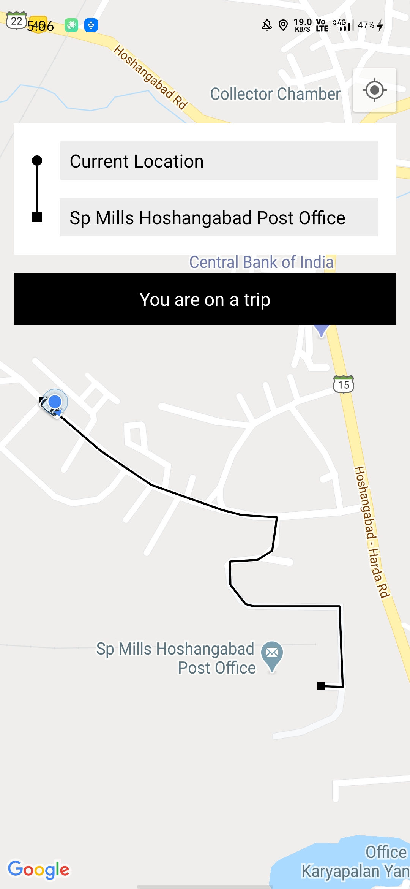
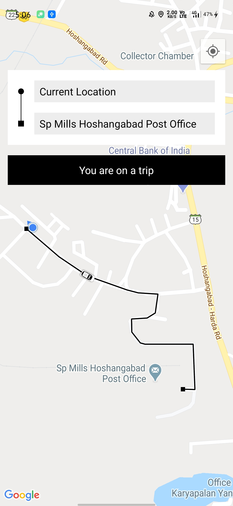
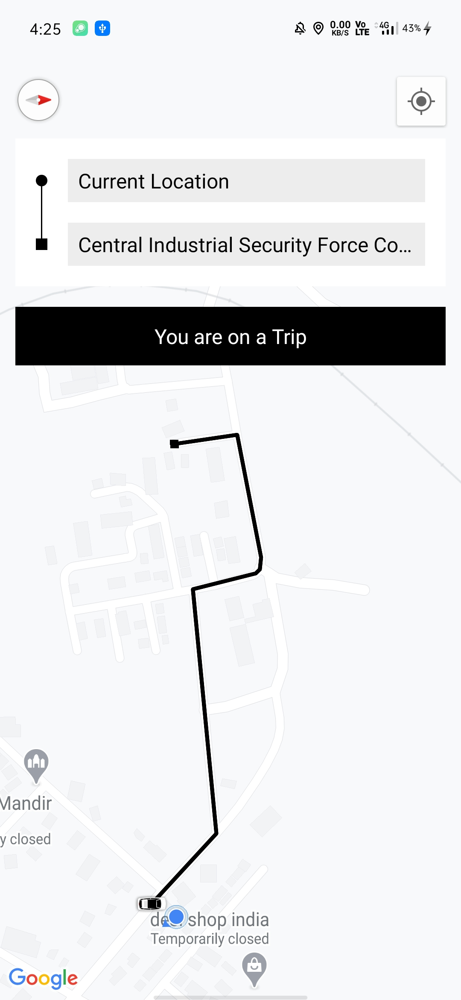
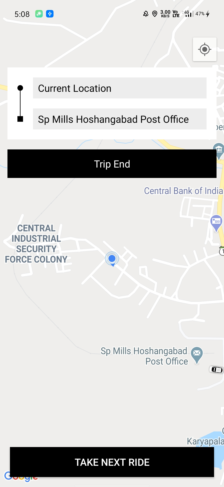

# RideSharing-UberLyft-Clone

 ##### Made in Kotlin
 
 ### Aim
 * ##### To Create an Ridesharing App like Uber and Lyft
 * ##### Learning about Google's direction and places API

### Features
* Select Source and Destination
* Car animation

### `Screen Shots`
<table>
  <tr>
    <td></td>
    <td></td>
  </tr>
  <tr>
    <td></td>
    <td></td>
  </tr>  
</table>

<a href="./ScreenShots/vid.mp4">Watch Demo</a>
